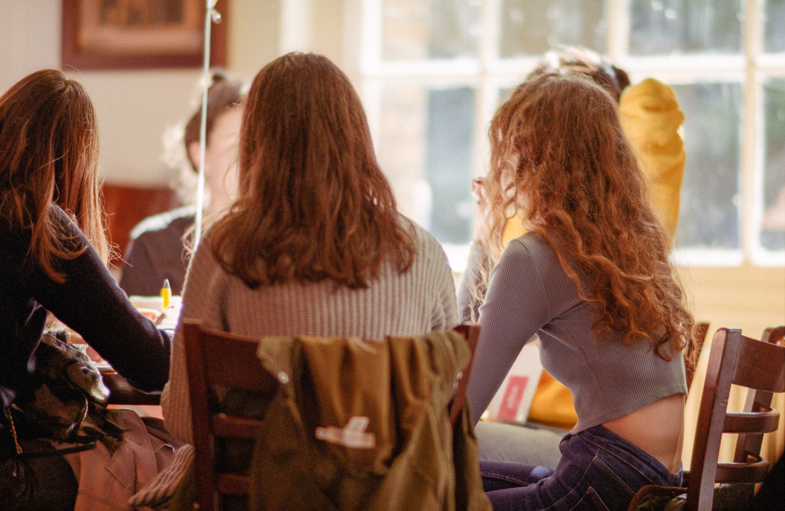
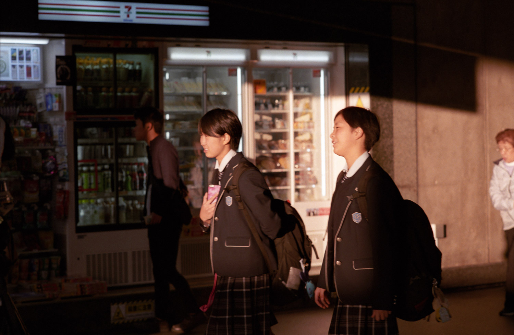
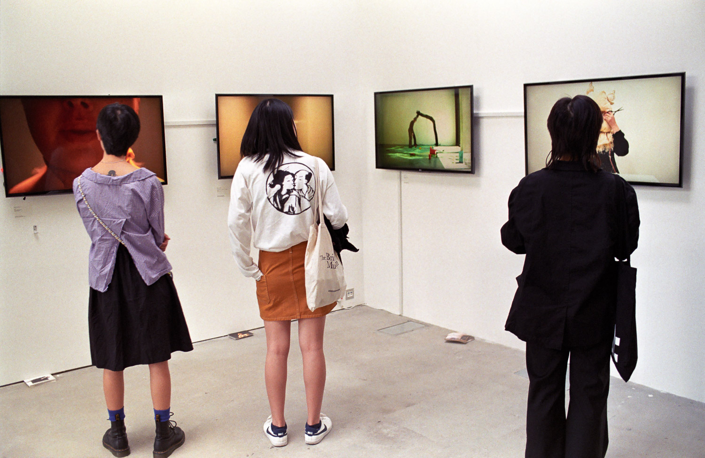
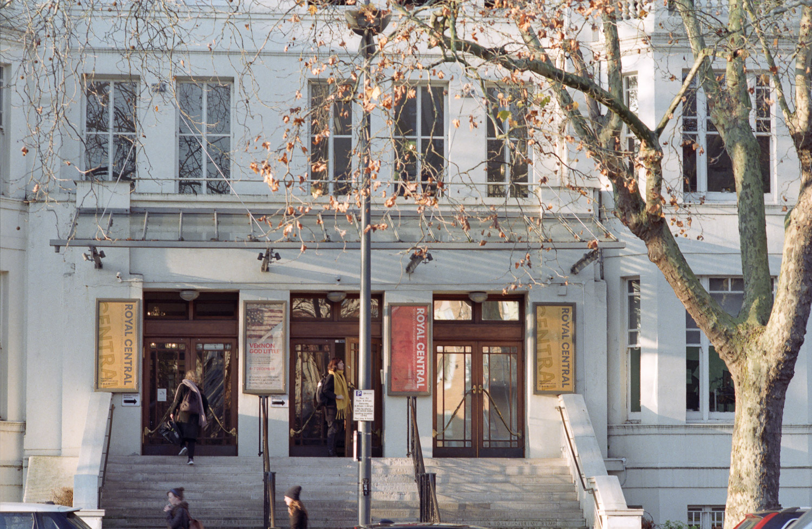
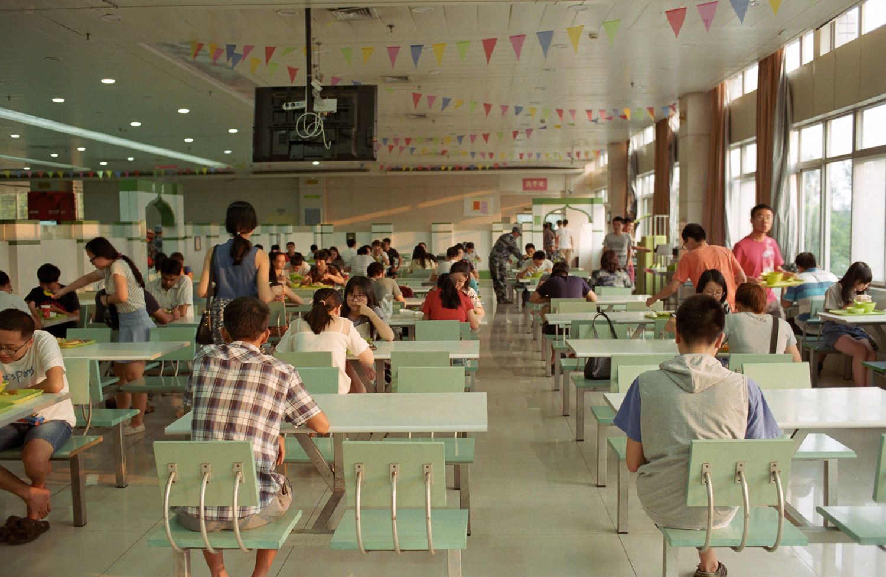
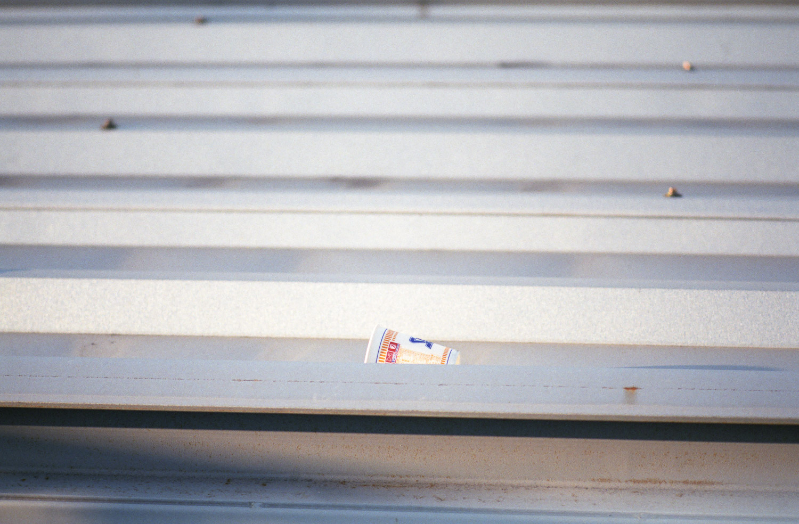
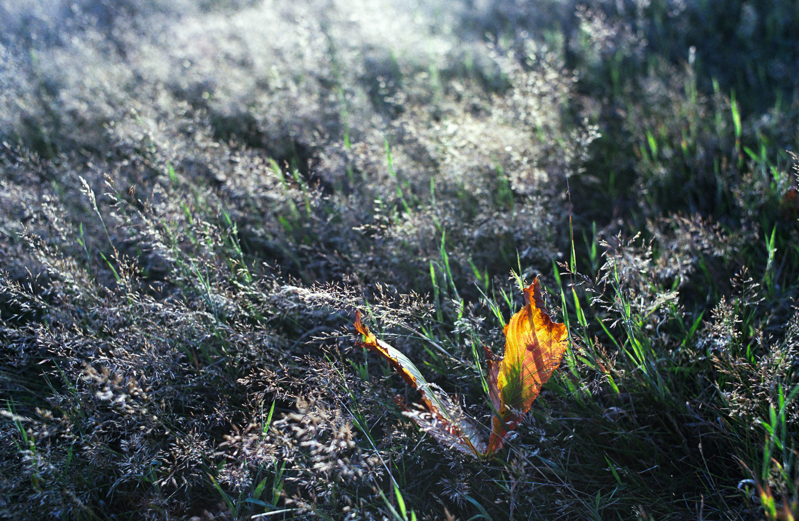
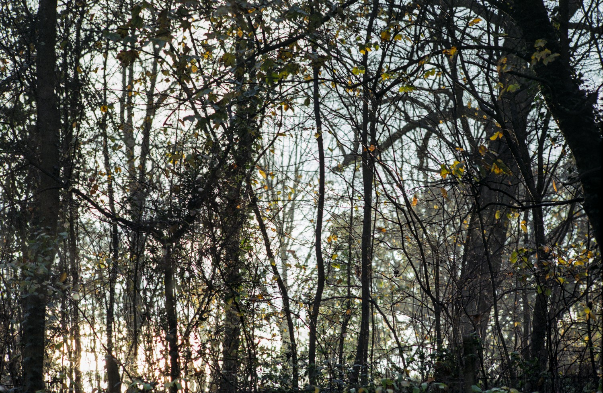
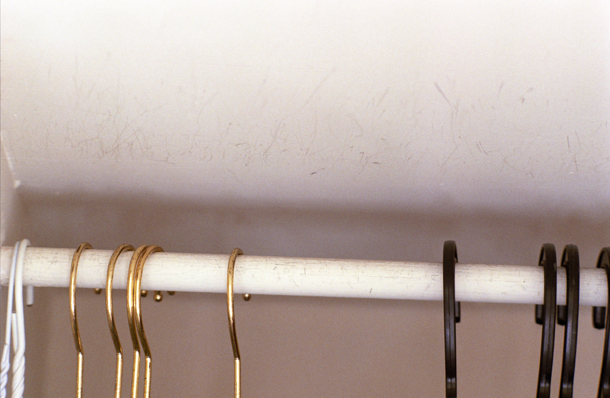
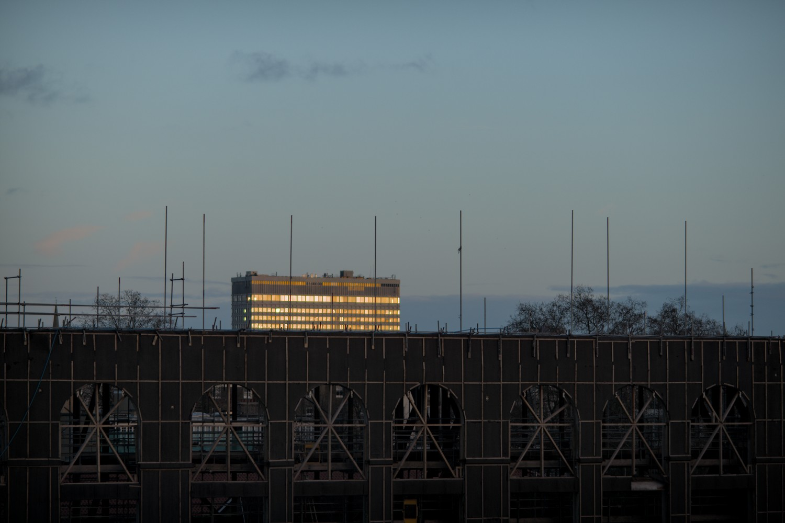

--

I first visited Japan in 2009 and have been returning every year. What is it about this place that draws me back?

I first visited Shikokuchuo in 2016. Now when I return to Japan, it is to Shikokuchuo that I must go. What is it about this place that draws me back so?

I have come to realise that my photography over the past 10 years has been about trying to capture that unique time-space. The essence of that physical place and experience. That feeling that keeps drawing me back.

Each sentiment on one sliver of photographic film.

I have come to realise that this is not actually an attempt at documentation. Rather, of creation – that of my own Shikokuchuo. A transformation of a time-space into a mind-construct – an idealisation, imagination, fantasy...

One sliver of photographic film at a time.

For I can sometimes find Shikokuchuo elsewhere. Perhaps it can be re-created. This project has in its own way become somewhat of an obsession, a compulsion.

Can photography simultaneously be trigger and form of therapy?

--

2009年は初めて日本へ行ってから、毎年帰るようにして来た。なぜこのところに惹かれているのかわからない。

2016年は初めて四国中央へ行った。それから、日本へ行くたびに、四国中央へ行かなければならないのだ。そのところに、なぜこのように惹かれているのかわからない。

この過ごした10年は写真で一種独特な時空を取るようにしていたのがわかって来た。その物理的なところと経験の神髄なのだ。いつもその惹かれている感じなのだ。

フィルムは一枚に心情一つずつなのだ。

これはドキュメンテーションではないのがわかって来た。逆に創造なのだ、自分の心中の四国中央を。時空から想念に変換なのだ、理想とか、想像とか、ファンタジーとか...

フィルム、一枚ごとに...

たまに他のところで四国中央が見つけられるので、再創造が出来るかもしれないのだ。このプロジェクトはこのようにオブセッションになったのだ。

写真は同時に誘発だけではなく療法もなれるか。
