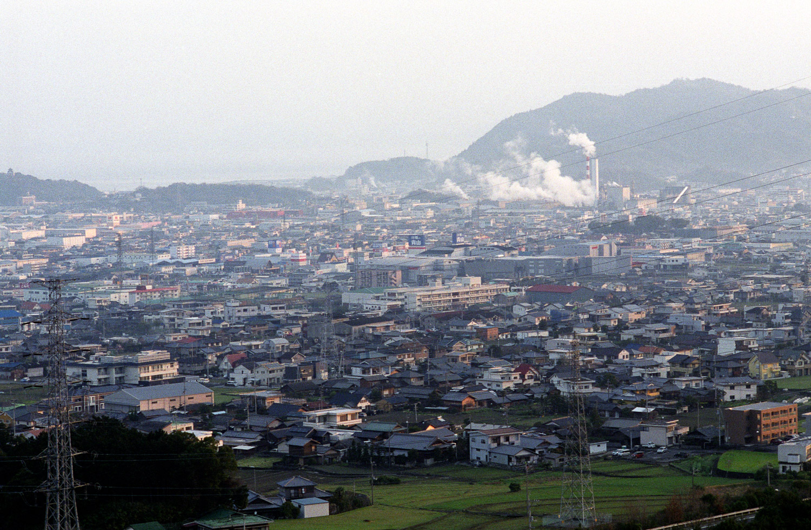
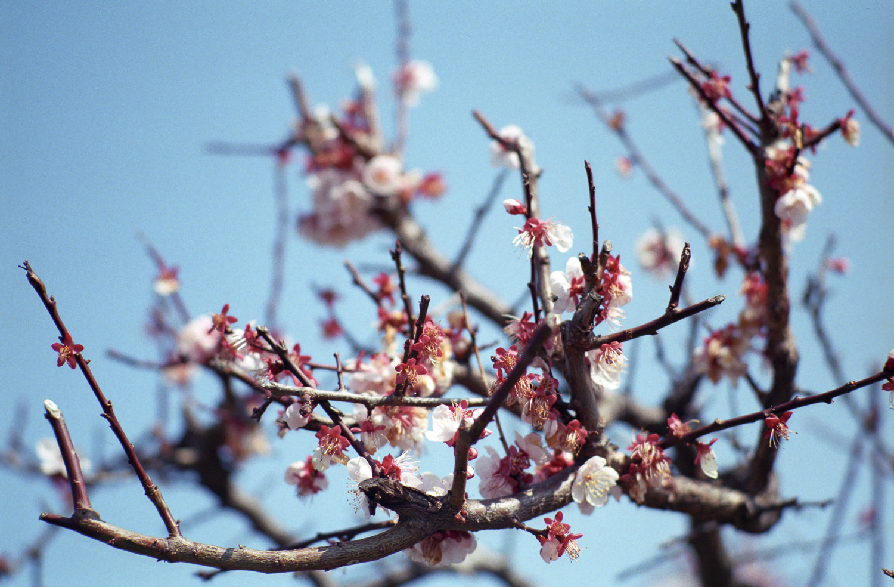
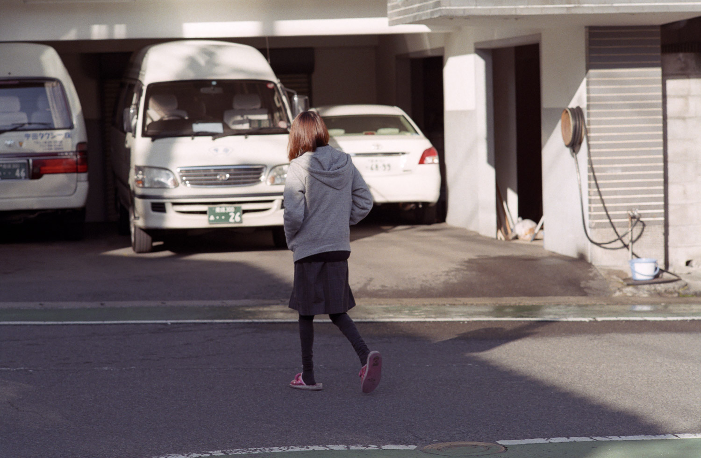
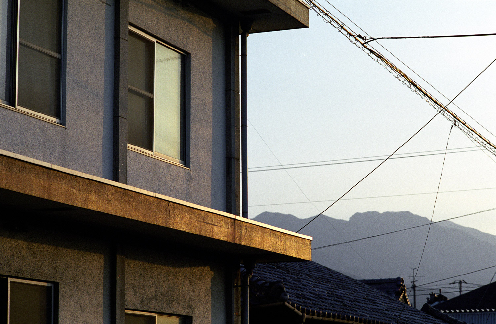
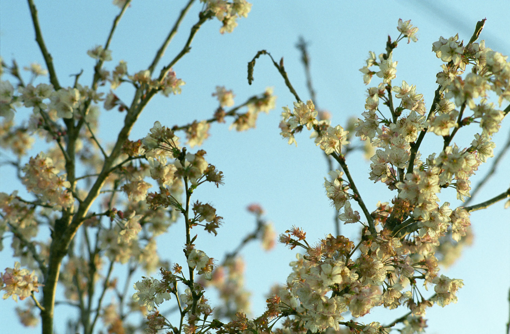
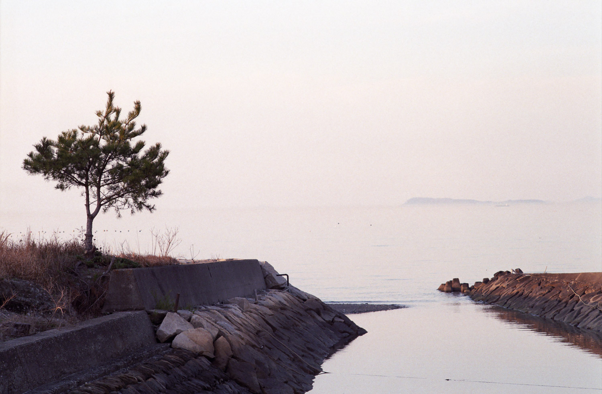
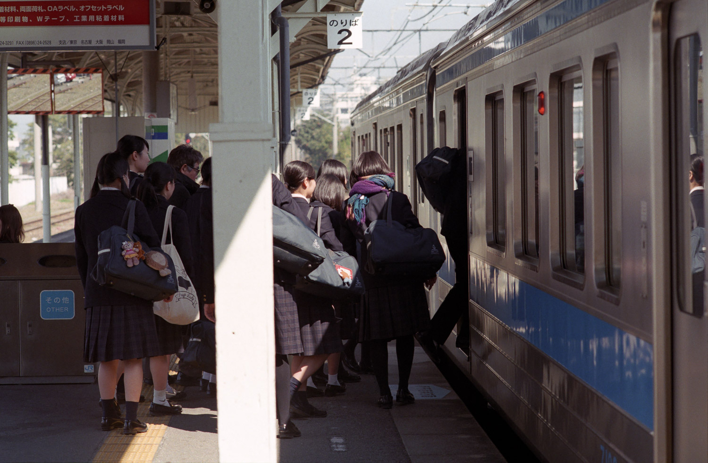
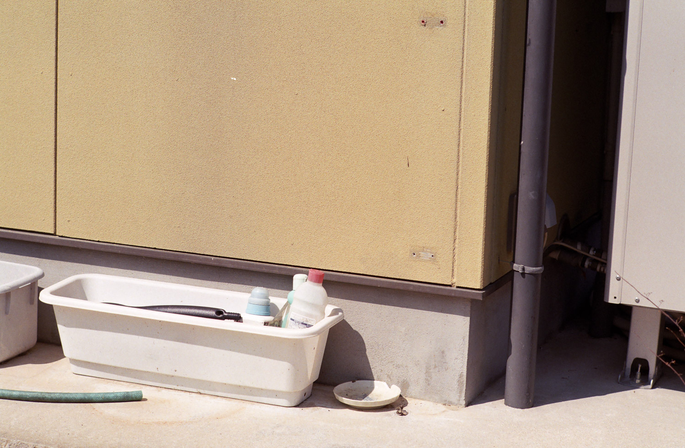
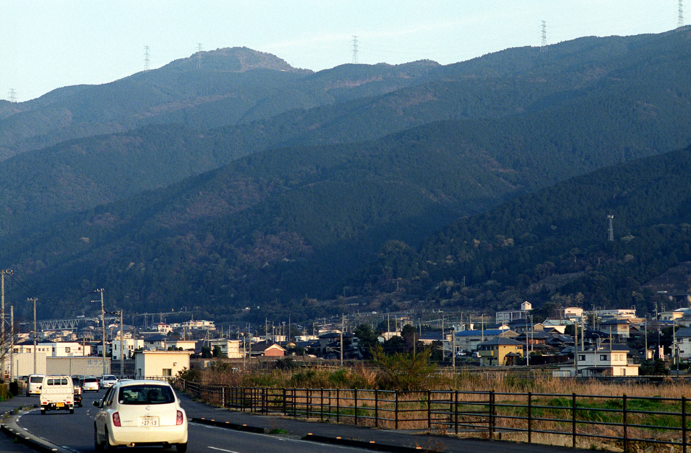
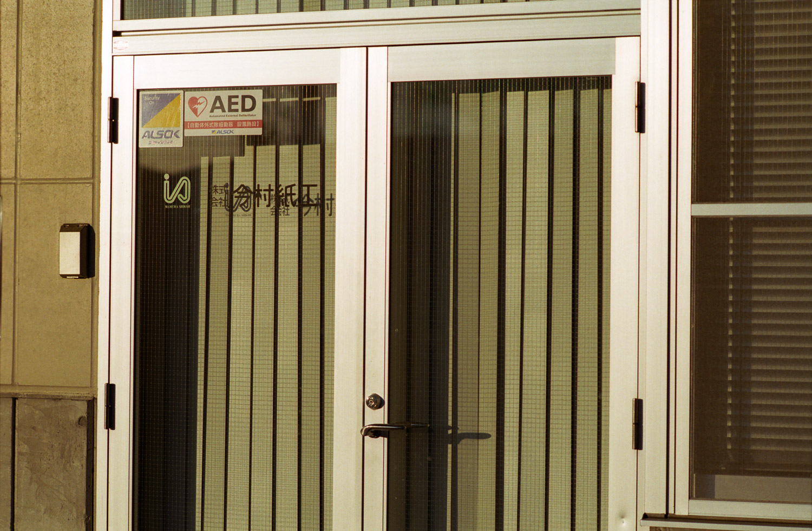

<script src="js/photosync.js"></script>

--

```
  “I want to do it to protect the things I cherish.”
```

line from Shodo Girls (film, 2010)

Shikokuchuo is a coastal city located in Ehime prefecture on the smallest of Japan’s four main islands. It is the leading producer of paper and paper products in the country, a centre of industry set in a traditional rural landscape.

Founded through the amalgamation of smaller towns in 2004, it literally means “Shikoku Central City” and was named in a time when it had hoped to become an important centre for the entire Shikoku island. It is presently dealing with the consequences of rural depopulation and relative economic decline.

A 2010 film, Shodo Girls, has as its subject a high school performance calligraphy contest set in Shikokuchuo.

This, as in the film, provided a focal point for the community revival of the city, as evidenced by the posters and placards still remaining at various filming locations.

Whilst the immediate effects have long since dissipated, the spirit of the film lives on.

--

```
  「好きな物のために、大切な物を守るために頑張りたい。」
```

「書道ガールズ」と言う映画からの引用だ。

四国中央は愛媛県の海岸にある町で、国の一番主要な製紙の町で、美しくて伝統的な風景にある工業都市である。

2004年、小さな町が合併した四国中央市が生まれた。四国全体の重要な中心地になるはずだったと言う時代に命名されたのだ。 現在、地方の人口減少と相対的な経済衰退の結果を扱っている。

2010年に公開された「書道ガールズ!! わたしたちの甲子園」と言う映画は四国中央市にある高校書道パフォーマンス甲子園を主題としたのだ。

これは、映画のように、町の社会の再生に焦点を提供した。映画の張り出しなどもいろいろなところで見つけられるのだ。

町にとって、映画の直接的な影響はずっと前に消えていたが、精神は生き延びる。
